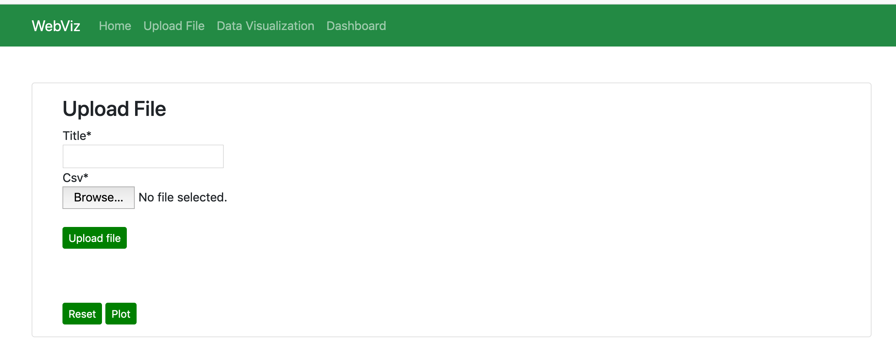
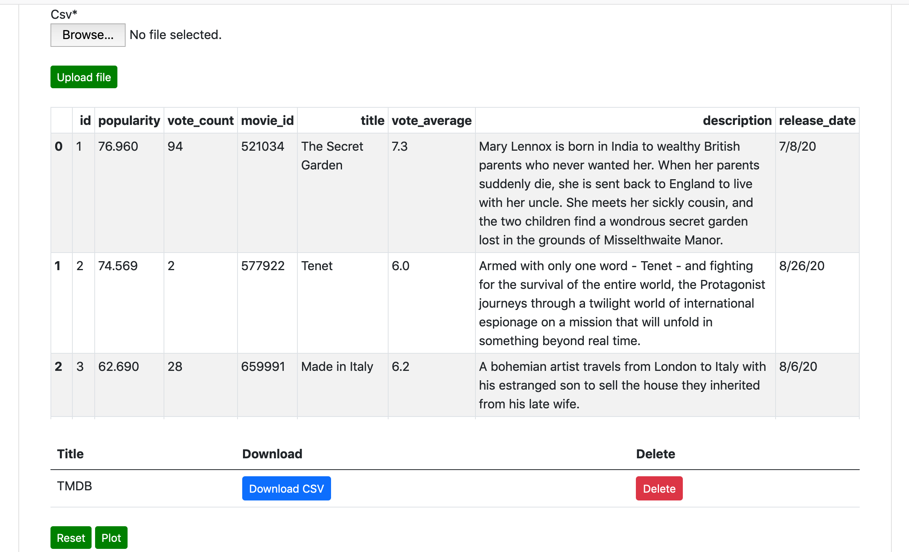
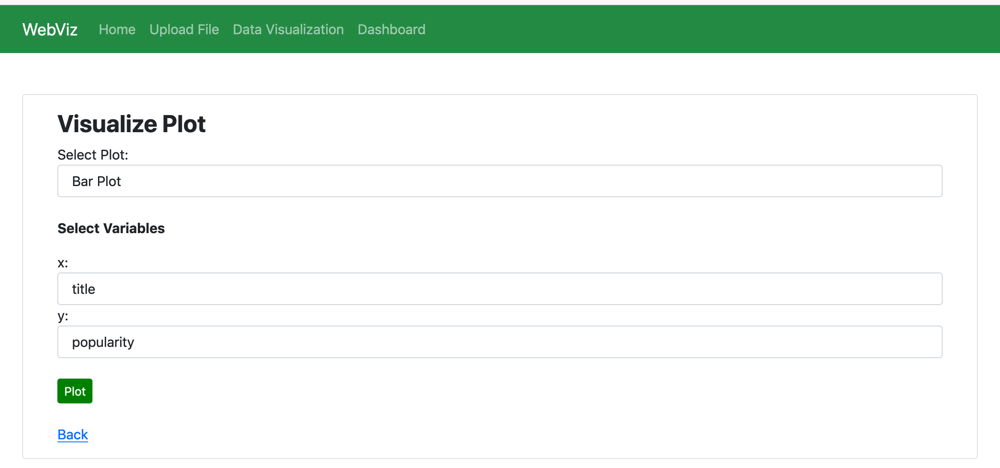
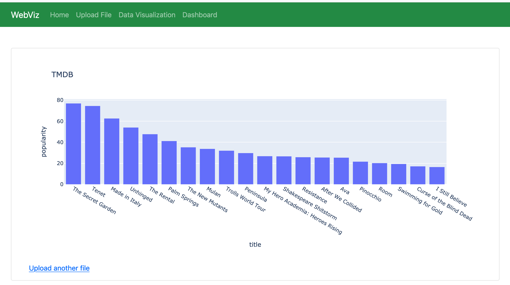

# WebViz: Web Based Data Processing and Visualization using Plotly and Django
This is a simple Django app for data analyzing and plotting which allows users to upload CSV file and visualize the data. The objective is processing, analyzing, and plotting based on uploaded data. The user has full control over the visibility of the raw data, basic information such as number of rows, columns, null values, datatypes, etc., descriptive statistics such as count, mean, std, max, min, etc. The user can perform basic data cleaning such as handling missing values. Several different options for plotting are available; barplot, scatterplot, histograms. The plot can be saved as a PNG file. Other data processing features and plots will be added in the next version. 

## Example:
##### 1. Upload File 
 

##### 2. Plotting

## Installation and Deployment

### Environment setup using Anaconda
- Anaconda installation and setup :
    - [Anaconda](https://docs.anaconda.com/anaconda/navigator/install/) ([Windows](https://docs.anaconda.com/anaconda/install/windows/)/[Linux](https://docs.anaconda.com/anaconda/install/linux/)/[MacOS](https://docs.anaconda.com/anaconda/install/mac-os/))
    - [Miniconda](https://docs.conda.io/en/latest/miniconda.html) ([Windows](https://docs.conda.io/en/latest/miniconda.html#windows-installers)/[Linux](https://docs.conda.io/en/latest/miniconda.html#linux-installers)/[MacOS](https://docs.conda.io/en/latest/miniconda.html#macosx-installers))
- Programming language: Python (version 3.7)
- Using the terminal or an Anaconda Prompt, create a new environment – 

    ``conda create –n webviz python=3.7``
- Activate new environment - **$ conda activate webviz**
- Clone this repository from Github:
    – open terminal and select a project path - ``cd PATH``
    - To clone type - 
    
    ``git clone https://github.com/JagritiG/django-webviz.git``

        
### Deployment on Localhost:8000
- Create an virtual environment and activate env
- Navigate to project **django-webviz** folder
- Install requirements.txt  using pip - ``pip install –r requirements.txt``
- Navigate to project **webviz**  (project name)
- Run command `ls` to check the right path: 
[__init__.py  db.sqlite3  manage.py  media  static  viz  webviz]
- Create Database & connect it within the **settings.py** (e.g. MySQL, Postgres)
- Run following commands for database migrations:
     
     ``python3 manage.py makemigrations``
     
     ``python3 manage.py migrate``
- Run following command to collect all static files:
    
    ``python3 manage.py collectstatic``
- Run following command to run the server:
    
    ``python3 manage.py runserver``
    
- Open localhost **localhost:8000** to see the pages
- Go to **Upload File**, **localhost:8000/upload/** and upload a csv file and plot the figure
- To navigate to **admin** open **localhost:8000/admin/** 
(admin name: admin and password: webviz123)

### Deployment on Live server using cPanel
1. Log into cPanel Account 
2. Open File Manager
3. Zip project-folder and upload in the File manager/root directory (e.g. webviz.zip)
4. Database Setup: (MySQL)
    - Navigate to cPanel 
    - Open **DATABASES -> MySQL Database**
    - Create database for the project: give <**database-name**> and click on <**Create Database**> (e.g. webviz)
    - click <**Go Back**>
    - Create user (Give user name, password) and click on <**Create User**> (e.g. user1, user123)
    - click <**Go Back**>
    - Add user to the database: in the section <**Add User To Database**> -> 
    select user and database and click on <**Add**>
    - Give Privileges to this user: select all the privileges and click on <**Make Changes**>
    - Now navigate to **cPanel -> MySQL Database** -> you can see database is created.

5. Configure database credential in **settings.py** -> 
    ###
        DATABASES = {
                'default': {
                    'ENGINE': 'django.db.backends.mysql', 
                    'NAME': 'database-name',
                    'USER': 'user-name',
                    'PASSWORD': 'password',
                    'HOST': 'localhost', 
                    'PORT': '3306',
                }
        }
    
6. Configure domain name in **settings.py**
    ###
        ALLOWED_HOSTS = ['domain_name.com', 'www.domain_name.com']

7. Configure Python App 
    - Navigate to **cPanel -> SOFTWARE** and Click on <**Python Setup App**>
    - Click <**Create Application**>
    - Select python version - (e.g. 3.8.6)
    - Add Application root -> <**project-name**> (e.g. webviz)
    - Set Application url -> select **domain_name.com**
    - Click <**Create App**> 
    
8. Install requirements.txt file
    - Navigate to **cPanel -> SOFTWARE** and Click on <**Python Setup App**>
    - Select Aap -> <**Edit**>
    - Add **requirements.txt** file and click on <**Run Pip Install**> to install all the required modules

9. Create Database Table
    - Navigate to **cPanel -> SOFTWARE** and Click on <**Python Setup App**>
    - Select Aap -> <Edit>
    - Run Script: **manage.py migrate**
    - To check Database table navigate to ****cPanel -> DATABASES -> phpMyAdmin**

10. Configure **passenger_wsgi.py**
    - add **from webviz.wsgi import application**
    ###
          import os
          import sys
          
          from webviz.wsgi import application

